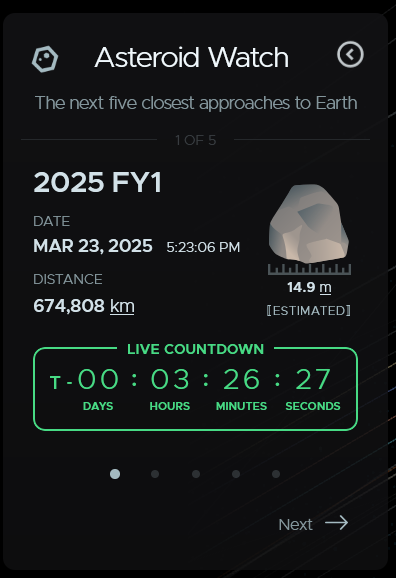

# Vis in the Wild
By Nathan Suer
## My visualization
https://eyes.nasa.gov/apps/asteroids/#/home

## Purpose of the visualization
<!-- What is the purpose of this visualization?  -->
The purpose of this visualization is to provide an interactive tool for users to explore and learn about asteroids, their orbits, and potential impacts with Earth. The visualization aims to educate the public about near-Earth objects (NEOs) and promote interest in astronomy and asteroid research.

## Data
<!-- What is the data?  How was the data captured or collected? -->
The data used to create this visualization is from the Ceneter for Near-Earth Object Studies and the NASA Jet Propulsion Labratory's Solar Systems Dynamics website (https://ssd.jpl.nasa.gov/). The data includes information about the orbits, sizes, and classifications of asteroids, as well as their close approaches to Earth. This data is collected through various telescopes, space missions that track and monitor NEOs, and mathematical models that predict their trajectories.

## Users
<!-- Who are the users that this visualization was made for?  Experts, general public, children, patients, mechanics, athletes+trainers...?   -->
The intended users for this visalization are the general public, educators, and students. The visualization is designed to be user-friendly and accessible, allowing people of all ages and backgrounds to explore and learn about asteroids and their significance in our solar system. It can also be used by educators as a teaching tool in classrooms to engage students in astronomy and planetary science.

## Questions + Insights
<!-- Questions+Insights: What questions can people ask+answer about this data using this visualization?  How can they find the answers with this tool?Show some example insights someone can arrive at using this tool -->
Some questions that people can ask and answer using this visualization include:
- What are the closest asteroids to Earth right now?

- Where are some of the nearest famous asteroids to Earth right now?

- What are some essential stats/facts about famous asteroids? 

- How long do the orbits of asteroids take?

- What are some FUn Facts about asteroids?

- Where will asteroids and certain planets be in the future?

## Visual and Interaction Design Choices
<!-- Comment on the visual and interaction design choices- are their choices effective? Are there any design choices that are not effective, and how could they be improved?  -->
The visual and interaction design choices in this visualization are generally effective. The use of a 3D interactive model allows users to easily navigate and explore the positions of asteroids in relation to Earth, asteroids, and Planets. The color coding and labeling of asteroid and plenetary orbits provide clear information about their current, previous, and future positions. Overall, the design is user-friendly and engaging, making it easy for users to find the information they are looking for.

However, one thing that is not effective is the lack of instruction on how to use the visualization. While it is relatively intuitive, a brief tutorial or guide for first-time users could improve the user experience and help them get the most out of the tool. Additionally, some users may find it challenging to interpret the 3D model and may benefit from additional visual aids or explanations.

## Limitations
<!-- What are the limitations of this design- what can't someone do with this visualization -->
Some limitations of this visualization include:
- Limited Data: The visualization only incluides a small amount of data about each asteroid, such as its name and orbit. Users may want more detailed information about the composition, history, or potential hazards of specific asteroids.
- Users can only select planets and famous asteroids. They cannot select any random asteroid in the solar system. This may limit users' ability to explore and learn about less well-known asteroids.
- Data not complete: Due to the outer space being so large, the data on asteroids is not complete. There are many asteroids that have not been discovered or tracked, so the visualization may not provide a complete picture of all asteroids in our solar system.

## AI Use
I used github copilot to help me write this assignment. I didn't prompt it with anything spedcific, but I let it autocomplete my sentances and help me write the assignment. I also used it to help me write the markdown for this assignment. I did not use any other AI tools for this assignment. I made edits after it autocompleted.